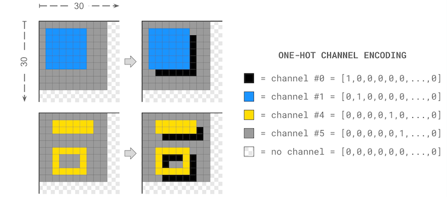

Description
Solving a task is only the first step. Doing it efficiently is harder.

Today’s AI systems perform well on familiar tasks but often struggle with new ones. This gap is highlighted by François Chollet's ARC-AGI benchmark suite (and subsequent ARC Prize competitions), in which each task is presented as a series of grids illustrating some specific transformation.

In this competition, you’ll work with tasks from the ARC-AGI public training set (v1) and build neural networks that reproduce each transformation. Your models must be correct—and as small as possible. Your models must be correct—and as small as possible. You’ll submit ONNX-formatted networks and aim to jointly minimize their size and parameter count. The objective is to have a network that solves each task with as few operations as possible.

Strong solutions could help define how many layers of computation these tasks actually require, and could serve as reference implementations and support research into more adaptable AI systems.

For example, consider the following (hypothetical) task #000:

Your .zip submission might include a file task000.onnx that embodies the following single-layer 3×3 convolutional network:

def weight(channel_out, channel_in, kernel_coord):
  if kernel_coord == ( 0,  0) and channel_in == channel_out: return 1.0
  if kernel_coord == ( 0,  0) and channel_in != 5 and channel_out == 0: return -1.0
  if kernel_coord == (-1, -1) and channel_in != 5 and channel_out == 0: return 1.0
  if kernel_coord == (-1, -1) and channel_in != 5 and channel_out == 5: return -1.0
  return 0.0

network = neurogolf_utils.single_layer_conv2d_network(weight, kernel_size=3)
When applied to a 30×30 image grid with a channel depth of ten, the above network would require 900 parameters in total.

Constraints
All tensors and parameters in each ONNX network file must have statically-defined shapes so that the performance of the network can be properly evaluated. In addition, the following ONNX operations are disallowed: Loop + Scan + NonZero + Unique + Script + Function. Finally, the size of each ONNX file is limited to at most 1.44MB. These constraints will be checked automatically by our official network validator.

Evaluation
For any of the 400 tasks in the ARC-AGI public training v1 benchmark suite, your team will earn a score of max(1, 25 - ln(cost)) for a functionally correct network whose cost is the sum of the following:

The total number of parameters in the network
The total memory footprint of the network (in bytes)
Functional correctness will be determined by validating the network against the original ARC-AGI benchmarks, the ARC-GEN-100K dataset, and a small private benchmark suite (so as to prevent teams from overfitting their solutions). To be eligible for points, your network must produce correct results across all of these tests.

Submission File
You must submit a file named submission.zip containing at most one ONNX file per task:

task001.onnx
task002.onnx
...
task400.onnx
Note: if our evaluation metric requires adjustments—or, if we have to ban additional ONNX operators that compromise the aims of our contest—we will announce such changes and rescore submissions as needed.